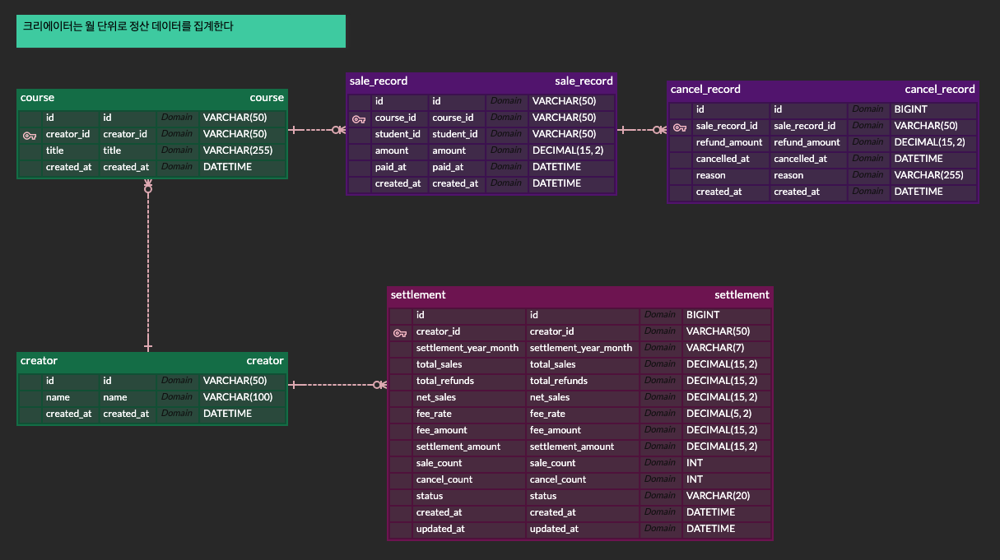

# 크리에이터 정산 API 서비스

## 1. 프로젝트 개요
본 프로젝트는 크리에이터의 강의 판매 및 취소 내역을 관리하고, 이를 바탕으로 정확한 정산 금액을 집계하는 백엔드 API 서비스입니다. 정산 시스템의 핵심인 금액 계산의 정확성과 시간 경계값 처리에 집중하여 설계되었습니다.

## 2. 기술 스택
- Framework: Spring Boot 3.x (Java 17)
- Database: H2 (In-memory) — 평가자가 별도 DB 설치 없이 `./gradlew bootRun` 한 번으로 실행 가능하도록 의도적으로 선택
- ORM/Mapper: MyBatis
- Test: JUnit 5, Mockito, AssertJ
- Documentation: Swagger (SpringDoc)

## 3. 실행 방법
1. 프로젝트 루트 경로에서 ./gradlew bootRun 명령어를 실행합니다.
2. 서버가 기동되면 http://localhost:8080/swagger-ui.html 접속하여 API 명세를 확인합니다.
3. resources 폴더 내의 data.sql에 포함된 샘플 데이터를 통해 즉시 API 테스트가 가능합니다.
4. **H2 Console (데이터베이스 확인)**
    - 접속 주소: `http://localhost:8080/h2-console`
    - **JDBC URL**: `jdbc:h2:mem:settlement` (또는 본인의 application.properties에 설정한 값)
    - **User Name**: `sa`
    - **Password**: (없음, 빈칸)
    - 애플리케이션 실행 중 메모리 DB에 적재된 데이터를 직접 SQL로 조회할 수 있습니다.

## 4. 요구사항 해석 및 가정
- 정산 귀속 원칙: 결제 내역은 결제 완료 일시(paid_at) 기준, 취소 내역은 실제 취소 발생 일시(cancelled_at)를 기준으로 해당 월 정산에 반영합니다.
- 월 경계 정산 예시: 1월에 판매된 건이 2월에 취소될 경우, 1월 정산은 판매 금액이 온전히 집계되고, 2월 정산에서 해당 취소분만큼 마이너스(-) 처리되어 정산금이 차감됩니다.
- 수수료 및 절사: 순 판매 금액(판매-환불)의 20%를 수수료로 적용하며, 원 단위 미만은 버림(RoundingMode.DOWN) 처리하여 정산금 오차를 방지합니다.

## 5. 설계 결정과 이유
- DB 선택 (H2 In-memory): 평가 환경의 진입 장벽을 최소화하기 위해 H2를 선택했습니다. `schema.sql`과 `data.sql`을 애플리케이션 기동 시 자동 적재하여, 평가자가 별도의 DB 설치·계정 설정 없이 `./gradlew bootRun` 한 번으로 즉시 API 테스트를 진행할 수 있도록 구성했습니다. 매 실행마다 동일한 초기 상태에서 시작하므로 테스트 결과의 재현성도 보장됩니다. 실 운영 환경에서는 MariaDB/MySQL로 전환할 수 있도록 MyBatis 표준 SQL 위주로 작성하였습니다.
- 시간 범위 설계 (Exclusive End): 말일 23:59:59 데이터를 누락 없이 포함하기 위해 모든 조회 쿼리에서 이상(>=) 및 미만(<) 기준을 사용했습니다. 예를 들어 3월 정산 시 조회 종료 범위를 4월 1일 00:00:00 미만으로 설정하여 밀리초 단위 데이터까지 완벽하게 집계합니다.
- 집계 쿼리 최적화: 운영자용 전체 집계 API 호출 시 발생하는 N+1 문제를 방지하기 위해, MyBatis 서브쿼리와 LEFT JOIN을 활용하여 단일 SQL 쿼리로 전체 크리에이터의 정산 현황을 한 번에 가져오도록 구현했습니다.
- 금전 데이터 타입: 부동 소수점 오차를 방지하기 위해 모든 금액 필드에 BigDecimal 타입을 사용했습니다.
- 상태 기반 정산 데이터 처리: PENDING 상태는 재조회 시 항상 최신 데이터로 재계산하며, CONFIRMED/PAID는 스냅샷을 그대로 반환합니다. 확정 이후의 데이터 정합성을 보장합니다.
- 확정 이후 취소 처리 (의도된 정책): 이미 CONFIRMED 또는 PAID 상태인 월의 정산은 변경하지 않으며, 이후 발생한 취소는 취소 일시 기준 월의 정산에 음수로 반영됩니다. 회계 무결성을 유지하기 위한 의도된 설계입니다.
- ON UPDATE CURRENT_TIMESTAMP 사용: 환불 및 상태 변경(PENDING → CONFIRMED → PAID) 이력 추적을 위해 H2 환경에서도 의도적으로 적용했습니다. updated_at으로 변경 시점을 확인할 수 있습니다.

## 6. 미구현 / 제약사항
- 인증 및 인가: 과제 요구사항에 따라 별도의 인증 라이브러리는 적용하지 않았으며, ID를 파라미터로 직접 전달받는 방식으로 구현했습니다.

## 7. AI 활용 범위
- **설계 검토:** 정산 시스템의 도메인 모델링, 월 경계(End of Month) 환불
  처리 정책, 그리고 정산 상태별 캐싱 전략(PENDING 재계산 vs CONFIRMED/PAID 스냅샷)에 대한 구조적 피드백 수렴.
- **기술 참조:** MyBatis 동적 쿼리의 CDATA 처리, BigDecimal 절사 정책 등 기술적 의사결정 시 참고.
- **테스트 시나리오 도출:** 부분 환불 누적, 월 경계 취소, 경계값 등 복잡한 정산 시나리오에 대한 검증 케이스 발굴 보조.
  **활용 도구:** Claude, Gemini (설계 검토/문서 정리는 Claude, Gemini 등 용도별로 병행 활용)
> 코드 작성과 최종 설계 결정은 모두 본인이 직접 수행했으며, AI는 검토
> 및 아이디어 발산 도구로 활용했습니다.

## BE 과제 선택 시 추가 항목:
- 정산 확정(settlement) 상태 관리: PENDING → CONFIRMED → PAID
    - 크리에이터 월별 정산 조회 및 생성
        - Endpoint: GET /api/settlements/creators/{creatorId}
    - 정산 확정 (선택 구현 항목)
        - Endpoint: PATCH /api/settlements/{id}/confirm
    - 정산 지급 완료 (선택 구현 항목)
        - Endpoint: PATCH /api/settlements/{id}/pay
    - 운영자용 기간 내 전체 정산 현황 집계
        - Endpoint: GET /api/settlements
- 동일 기간 중복 정산 방지 로직

## 8. API 목록 및 예시
- 크리에이터 월별 정산: GET /api/settlements/creators/{creatorId}?yearMonth=2025-03
- 운영자용 기간 정산 집계: GET /api/settlements?startDate=2025-03-01&endDate=2025-03-31
- 판매 내역 등록: POST /api/sales
- 취소 내역 등록: POST /api/cancels

## 9. 데이터 모델 설명
- Creator: 크리에이터 기본 정보를 담는 마스터 테이블
- Course: 크리에이터가 소유한 강의 정보 테이블
- SaleRecord: 강의 판매 내역 테이블 (paid_at 기준 집계)
- CancelRecord: 판매 취소 내역 테이블 (cancelled_at 기준 집계, SaleRecord 참조)

## 10. 테스트 실행 방법
IDE에서 Run Test 또는 ./gradlew test 명령어로 실행할 수 있습니다.

### 10.1 SettlementServiceTest (Service Layer)
- calculateMonthly_Success: 명세서 기준 정상 정산 계산(26만 판매, 11만 환불 시 12만 정산) 검증
- calculateMonthly_NegativeSettlement: 환불액이 판매액보다 커서 정산금이 음수가 되는 케이스 검증
- calculateMonthly_CreatorNotFound: 존재하지 않는 크리에이터 요청 시 예외 발생 확인
- calculateForPeriod_VerifyDateConversion: Swagger 입력 날짜가 서비스 내부에서 정산 시간 범위(다음날 00시 미만)로 정확히 변환되는지 확인

### 10.2 SaleRecordMapperTest (Mapper Layer)
- aggregate_BoundaryCheck: 3월 31일 23:59:59 데이터가 3월 정산 범위에 정상 포함되는지 SQL 검증
- aggregateByPeriod_SQLCheck: 3월 조회 시 2월 말일 데이터와 4월 초일 데이터가 집계에서 정확히 제외되는지 검증

### 10.3 수동 테스트 시나리오 (Swagger / Postman)

핵심 비즈니스 로직과 경계값 검증을 위한 21개의 수동 테스트 시나리오를
별도 문서로 정리했습니다.

📄 **[TEST_SCENARIOS.md](./TEST_SCENARIOS.md)** 참조

주요 검증 영역:
- **기본 정산 조회** (S1~S4): 월 경계 환불, 캐시 hit/miss
- **신규 등록 → 즉시 반영** (S5~S6): stale 캐시 검증
- **비즈니스 룰 거부** (S7~S8): 누적 환불 초과, 시점 역전
- **DTO Validation** (S9): 필수값/제약 위반
- **상태 전환** (S10~S11): PENDING → CONFIRMED → PAID 정/역방향
- **운영자 집계** (S12~S13): LEFT JOIN, 기간 검증
- **중복 방지** (S14): UNIQUE 제약 동작 확인
- **데이터 정합성** (S15~S21): 다중 환불 누적, BigDecimal 절사,
  밀리초 경계, 당일 처리 등

실행 순서대로 진행하면 의존성 있는 시나리오(S5→S8, S10→S11)도
자연스럽게 검증됩니다.

## 11. 수수료율 정책 및 확장성 설계

본 프로젝트는 현재 요구사항에 따라 20%의 고정 수수료율을 적용하고 있으나, 향후 비즈니스 확장을 고려하여 다음과 같은 확장 설계 방향을 수립하였습니다.

### 11.1 현재 구현 방식 (Fixed Rate)
- 설정 중심 관리: `application.yml`에 수수료율을 정의하여 코드 수정 없이 정책 변경이 가능하도록 구현했습니다.
- 정밀한 연산: `BigDecimal`과 `RoundingMode.DOWN`을 사용하여 정산 금액 계산 시 발생할 수 있는 소수점 오차와 원 단위 미만 절사 처리를 보장합니다.

### 11.2 향후 확장 방향 (Scalability)
1. 수수료 정책 테이블(Settlement_Policy) 도입
    - 수수료율과 적용 시작일(`apply_start_date`)을 관리하는 테이블을 설계합니다.
    - 정산 대상 월의 `paid_at` 또는 `cancelled_at` 시점에 유효했던 수수료율을 동적으로 조회하여 적용함으로써, 과거 정산 데이터의 정합성을 유지합니다.

2. 크리에이터별 차등 수수료
    - `Creator` 테이블에 `custom_fee_rate` 컬럼을 추가하여, 플랫폼 기여도에 따라 크리에이터마다 다른 수수료율을 적용할 수 있는 구조로 확장 가능합니다.

3. 정산 스냅샷 저장
    - 선택 구현 사항인 '정산 확정' 기능 도입 시, 확정 시점의 수수료율을 별도의 정산 내역 테이블에 기록(Snapshot)하여 정책이 변경되더라도 이미 완료된 정산 금액은 변하지 않도록 설계할 예정입니다.

### ERD 설명

  

### **[정산 시스템 ERD 구조]**

*   **Creator (크리에이터):** 시스템의 최상위 주체. (강사 정보)
*   **Course (강의):** 크리에이터가 소유한 강의. (1:N 관계)
*   **SaleRecord (판매 내역):** 수강생의 결제 이력. `course_id`를 참조하여 어떤 강의가 팔렸는지 기록.
*   **CancelRecord (취소 내역):** `sale_record_id`를 참조(1:1 또는 N:1). 특정 판매 건에 대한 환불 금액과 일시를 관리.
*   **Settlement (정산 내역):** 특정 월의 판매/취소 데이터를 집계한 결과물. `creator_id`별로 월간 정산 상태(PENDING, PAID)를 관리.

> **핵심 설계 의도:** 실시간 정산 금액 계산 시 `SaleRecord`와 `CancelRecord`를 조인하여 데이터 정합성을 유지하며, 확정된 정산 데이터는 `Settlement` 테이블에 스냅샷 형태로 저장하여 관리 이력을 남깁니다.

